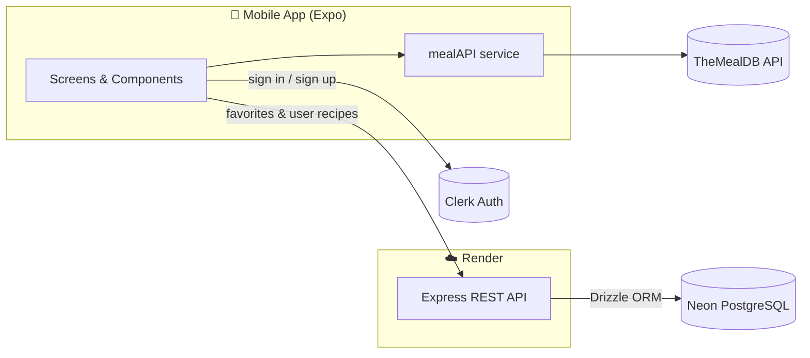
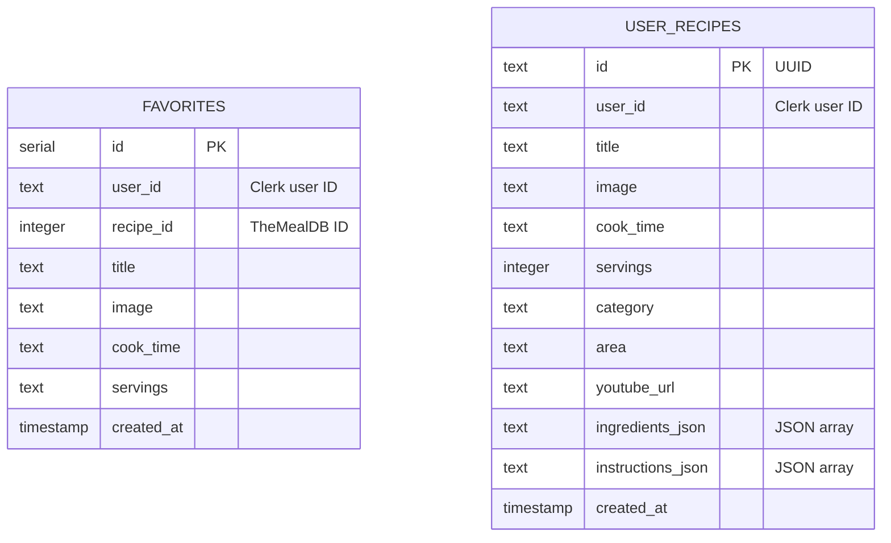

<div align="center">


# Mukaase

**A full-stack mobile recipe app: browse thousands of dishes, save your favorites, and build your own cookbook.**


</div>

---

## Table of Contents

- [Demo](#demo)
- [Screenshots](#screenshots)
- [About the Project](#about-the-project)
- [Features](#features)
- [Tech Stack](#tech-stack)
- [Architecture](#architecture)
- [Project Structure](#project-structure)
- [Getting Started](#getting-started)
  - [Prerequisites](#prerequisites)
  - [1. Clone the repository](#1-clone-the-repository)
  - [2. Backend setup](#2-backend-setup)
  - [3. Mobile app setup](#3-mobile-app-setup)
- [Environment Variables](#environment-variables)
- [API Reference](#api-reference)
- [Database Schema](#database-schema)
- [Deployment](#deployment)
- [Roadmap](#roadmap)
- [Contributing](#contributing)
- [License](#license)
- [Acknowledgements](#acknowledgements)
- [Contact](#contact)

---

## Demo

<!--
  HOW TO ADD VIDEOS
  GitHub only plays videos that are uploaded through its own editor:
    1. Open this README on GitHub and click the pencil (edit) icon.
    2. Drag and drop your .mp4 / .mov file (max 10 MB on free accounts) onto the editor where the placeholder is.
    3. GitHub inserts a link like https://github.com/user-attachments/assets/xxxx. Leave it on its own line and it will play inline.
  Alternatively, convert short clips to GIFs, save them in docs/media/, and reference them with .
-->

### Full walkthrough

> 🎬 _Video coming soon. Replace this line with your full app walkthrough video._

### Feature clips

| Sign up & email verification | Browsing & category filter |
| :---: | :---: |
| 🎬 _Video placeholder_ | 🎬 _Video placeholder_ |

| Search | Recipe detail & YouTube video |
| :---: | :---: |
| 🎬 _Video placeholder_ | 🎬 _Video placeholder_ |

| Saving favorites | Create / edit / delete your own recipe |
| :---: | :---: |
| 🎬 _Video placeholder_ | 🎬 _Video placeholder_ |

---

## Screenshots

<!--
  Save screenshots in docs/media/ and swap each placeholder for:
  
-->

| Sign In | Home | Search |
| :---: | :---: | :---: |
| _`docs/media/sign-in.png`_ | _`docs/media/home.png`_ | _`docs/media/search.png`_ |

| Recipe Detail | Favorites | Create Recipe |
| :---: | :---: | :---: |
| _`docs/media/recipe-detail.png`_ | _`docs/media/favorites.png`_ | _`docs/media/create-recipe.png`_ |

---

## About the Project

**Mukaase** is a cross-platform (iOS and Android) recipe app built with **React Native + Expo** on the front end and a **Node.js / Express** REST API backed by **PostgreSQL** on the back end.

Public recipes come from [TheMealDB](https://www.themealdb.com/). Everything personal, such as your favorites and your own recipes, is stored in a Postgres database and linked to your account. Authentication is handled by [Clerk](https://clerk.com/).

I built this project to practice the full mobile development lifecycle: designing screens, managing auth, consuming third-party APIs, building and deploying a REST API, and modelling relational data.

---

## Features

### 🔐 Authentication
- Email and password sign-up and sign-in powered by Clerk
- Email verification with a one-time code
- Protected routes: signed-out users are redirected to the sign-in screen, and signed-in users skip it
- Secure session storage on the device

### 🍲 Browse recipes
- Home feed with a **featured recipe** and a grid of recipes
- **Category filter** (Beef, Chicken, Dessert, Seafood, and more) loaded from TheMealDB
- Pull-to-refresh for new suggestions

### 🔍 Search
- Search by **recipe name**, falling back to **main ingredient** if there are no name matches
- Debounced input (300 ms) so the API isn't called on every keystroke

### 📖 Recipe details
- Hero image, cook time, servings, cuisine, and category
- Full ingredient list and step-by-step instructions
- **Embedded YouTube video** when the recipe has one
- Toast notifications for actions such as favoriting and deleting

### ❤️ Favorites
- Save or unsave any recipe with one tap
- Favorites are stored per user in Postgres, so they follow you across devices
- A dedicated Favorites tab shows saved recipes and your own creations, with a **"Yours"** badge on recipes you created

### ✍️ Your own recipes (full CRUD)
- **Create** recipes with title, image URL, category, cuisine, cook time, servings, YouTube link, ingredients, and instructions
- **Read** them on the same detail screen as public recipes
- **Update** them with a pre-filled edit form
- **Delete** them from the detail screen or the Favorites tab

### 🎨 Polished UI
- Custom fonts, a branded color palette, and an animated typing headline on sign-in
- Keyboard-aware forms that scroll each field into view
- Smooth image loading with `expo-image`

---

## Tech Stack

| Layer | Technology |
| --- | --- |
| Mobile framework | [React Native](https://reactnative.dev/) 0.81, [Expo](https://expo.dev/) SDK 54 |
| Navigation | [Expo Router](https://docs.expo.dev/router/introduction/) (file-based routing) |
| Authentication | [Clerk Expo](https://clerk.com/docs/quickstarts/expo) |
| Backend | [Node.js](https://nodejs.org/), [Express 5](https://expressjs.com/) |
| Database | [PostgreSQL](https://www.postgresql.org/) hosted on [Neon](https://neon.tech/) |
| ORM / migrations | [Drizzle ORM](https://orm.drizzle.team/) and Drizzle Kit |
| Recipe data | [TheMealDB API](https://www.themealdb.com/api.php) |
| Hosting | [Render](https://render.com/) (API), [EAS](https://expo.dev/eas) (mobile builds) |

---

## Architecture



**How the data flows:**

1. **Public recipes:** the app calls TheMealDB directly through `mobile/services/mealAPI.js`, which converts the raw API response into a consistent recipe shape.
2. **Authentication:** Clerk handles sign-up, verification, and sessions. Clerk's `user.id` is used as the key for all personal data.
3. **Personal data:** favorites and user-created recipes are sent to the Express API, which reads and writes them in Postgres using Drizzle ORM.
4. **Keep-alive:** in production, a cron job pings the API every 14 minutes so the free Render instance doesn't spin down.

---

## Project Structure

```
mukaase-app/
├── backend/                      # Express REST API
│   ├── drizzle.config.js         # Drizzle Kit configuration
│   ├── package.json
│   └── src/
│       ├── server.js             # App entry point and all routes
│       ├── config/
│       │   ├── db.js             # Neon + Drizzle connection
│       │   ├── env.js            # Environment variable loader
│       │   └── cron.js           # Keep-alive cron job
│       └── db/
│           ├── schema.js         # Table definitions
│           └── migrations/       # SQL migrations
│
├── mobile/                       # React Native (Expo) app
│   ├── app/                      # Screens (Expo Router file-based routes)
│   │   ├── _layout.jsx           # Root layout + Clerk provider
│   │   ├── (auth)/               # sign-in, sign-up, verify-email
│   │   ├── (tabs)/               # index (home), search, favorites
│   │   └── recipe/
│   │       ├── [id].jsx          # Recipe detail
│   │       ├── new.jsx           # Create recipe
│   │       └── edit/[id].jsx     # Edit recipe
│   ├── components/               # Reusable UI (RecipeCard, CategoryFilter, ...)
│   ├── services/mealAPI.js       # TheMealDB client + data transformer
│   ├── hooks/useDebounce.js      # Debounce hook for search
│   ├── constants/                # API URL, color palette
│   ├── assets/                   # Fonts, images, and screen styles
│   ├── ios/ & android/           # Native projects
│   ├── app.json                  # Expo config
│   └── eas.json                  # EAS Build profiles
│
└── docs/media/                   # Screenshots, GIFs, and videos for this README
```

---

## Getting Started

### Prerequisites

- [Node.js](https://nodejs.org/) 18 or newer, and npm
- A [Neon](https://neon.tech/) account (or any PostgreSQL database)
- A [Clerk](https://clerk.com/) application with **Email** sign-in enabled
- One of the following ways to run the app:
  - [Expo Go](https://expo.dev/go) on a physical device
  - **Xcode** for the iOS Simulator (macOS only)
  - **Android Studio** for an Android emulator

### 1. Clone the repository

```bash
git clone https://github.com/raacquah/mukaase-fullstack-mobile.git
cd mukaase-fullstack-mobile
```

### 2. Backend setup

```bash
cd backend
npm install
```

Create `backend/.env`:

```env
PORT=5001
DATABASE_URL=postgresql://<user>:<password>@<host>/<database>?sslmode=require
NODE_ENV=development
```

Create the database tables. Either push the schema with Drizzle Kit:

```bash
npx drizzle-kit push
```

or run the SQL files in `backend/src/db/migrations/` in order, for example in Neon's SQL editor.

Start the server:

```bash
npm run dev     # auto-restarts on changes (nodemon)
# or
npm start
```

Check that it's running:

```bash
curl http://localhost:5001/api/health
# {"success":true}
```

### 3. Mobile app setup

```bash
cd ../mobile
npm install
```

Create `mobile/.env`:

```env
EXPO_PUBLIC_CLERK_PUBLISHABLE_KEY=pk_test_xxxxxxxxxxxxxxxxxxxx
```

Point the app at your backend in `mobile/constants/api.js`:

```js
// Deployed API
export const API_URL = "https://<your-app>.onrender.com/api";

// Local API: use your computer's LAN IP, not "localhost", when testing on a phone
// export const API_URL = "http://192.168.x.x:5001/api";
```

Start the app:

```bash
npx expo start
```

Then press **`i`** for the iOS Simulator, **`a`** for an Android emulator, or scan the QR code with Expo Go.

To build and run the native projects directly instead of using Expo Go:

```bash
npx expo run:ios
npx expo run:android
```

---

## Environment Variables

### Backend (`backend/.env`)

| Variable | Required | Description |
| --- | :---: | --- |
| `PORT` | No | Port the API listens on. Defaults to `5001`. |
| `DATABASE_URL` | Yes | PostgreSQL connection string (Neon). |
| `NODE_ENV` | No | Set to `production` to enable the keep-alive cron job. |
| `API_URL` | Production only | Public URL the cron job pings, e.g. `https://<your-app>.onrender.com/api/health`. |

### Mobile (`mobile/.env`)

| Variable | Required | Description |
| --- | :---: | --- |
| `EXPO_PUBLIC_CLERK_PUBLISHABLE_KEY` | Yes | Publishable key from your Clerk dashboard. |

> ⚠️ Never commit `.env` files. Add them to `.gitignore`.

---

## API Reference

Base URL: `http://localhost:5001/api` (local) or your Render URL (production).

### Health

| Method | Endpoint | Description |
| --- | --- | --- |
| `GET` | `/health` | Returns `{ "success": true }` if the server is up. |

### Favorites

| Method | Endpoint | Description |
| --- | --- | --- |
| `POST` | `/favorites` | Save a recipe to favorites. Returns `409` if it's already saved. |
| `GET` | `/favorites/:userId` | List a user's favorites. |
| `DELETE` | `/favorites/:userId/:recipeId` | Remove a favorite. |

<details>
<summary>Example: <code>POST /favorites</code></summary>

```json
{
  "userId": "user_2abc123",
  "recipeId": 52772,
  "title": "Teriyaki Chicken Casserole",
  "image": "https://www.themealdb.com/images/media/meals/wvpsxx1468256321.jpg",
  "cookTime": "30 minutes",
  "servings": "4"
}
```

</details>

### User recipes

| Method | Endpoint | Description |
| --- | --- | --- |
| `POST` | `/user-recipes` | Create a recipe. |
| `GET` | `/user-recipes/:userId` | List a user's recipes (summary fields). |
| `GET` | `/user-recipes/:userId/:recipeId` | Get one recipe with ingredients and instructions. |
| `PUT` | `/user-recipes/:userId/:recipeId` | Update a recipe. |
| `DELETE` | `/user-recipes/:userId/:recipeId` | Delete a recipe. |

<details>
<summary>Example: <code>POST /user-recipes</code></summary>

```json
{
  "userId": "user_2abc123",
  "title": "Grandma's Jollof Rice",
  "image": "https://example.com/jollof.jpg",
  "cookTime": "45 minutes",
  "servings": 6,
  "category": "Rice",
  "area": "Ghanaian",
  "youtubeUrl": "https://www.youtube.com/watch?v=XXXXXXXXXXX",
  "ingredients": ["2 cups long-grain rice", "4 tomatoes", "1 onion"],
  "instructions": ["Blend tomatoes and onion.", "Fry the paste.", "Add rice and stock, then simmer."]
}
```

`ingredients` and `instructions` can be arrays, or a single string separated by new lines or semicolons.

</details>

---

## Database Schema



---

## Deployment

### Backend on Render

1. Create a new **Web Service** connected to this repository.
2. Set **Root Directory** to `backend`, the build command to `npm install`, and the start command to `npm start`.
3. Add the environment variables `DATABASE_URL`, `NODE_ENV=production`, and `API_URL`.
4. Apply any new migrations to the production database before deploying.

### Mobile with EAS Build

```bash
npm install -g eas-cli
eas login
eas build --profile preview --platform all      # internal test build
eas build --profile production --platform all   # store build
```

Make sure `EXPO_PUBLIC_CLERK_PUBLISHABLE_KEY` is set for each EAS environment.

---

## Roadmap

- [ ] Verify Clerk session tokens on the backend instead of trusting `userId` from the request
- [ ] Split `server.js` into routes, controllers, and services
- [ ] Image uploads for user recipes (instead of image URLs)
- [ ] Sign in with Apple and Google
- [ ] Offline caching of favorites
- [ ] Dark mode
- [ ] Unit and end-to-end tests

---

## Contributing

This is a personal project, so I'm not accepting pull requests. Feedback, bug reports, and suggestions are welcome, though. Feel free to [open an issue](https://github.com/raacquah/mukaase-fullstack-mobile/issues).

---

## License

This is a personal project. **All rights reserved.** The code is shared for viewing only, and it may not be copied, modified, or redistributed without permission. See [`LICENSE`](LICENSE) for details.

---

## Acknowledgements

- [TheMealDB](https://www.themealdb.com/) for the free recipe API
- [Clerk](https://clerk.com/) for authentication
- [Neon](https://neon.tech/) for serverless Postgres
- [Expo](https://expo.dev/) for making React Native development enjoyable
- [Ionicons](https://ionic.io/ionicons) for icons

---

## Contact

**Richmond Acquah**

- GitHub: [@raacquah](https://github.com/raacquah)
- LinkedIn: _add your LinkedIn URL_
- Email: _add your email_

<div align="center">

⭐ If you found this project interesting, consider giving it a star!

</div>
